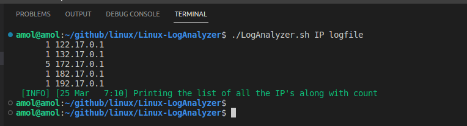
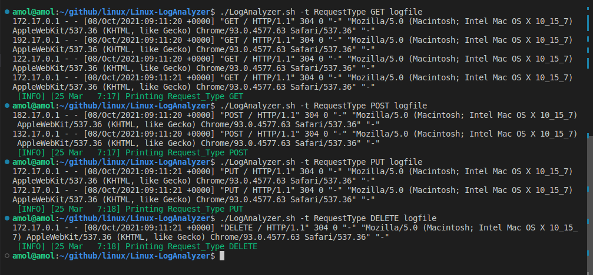
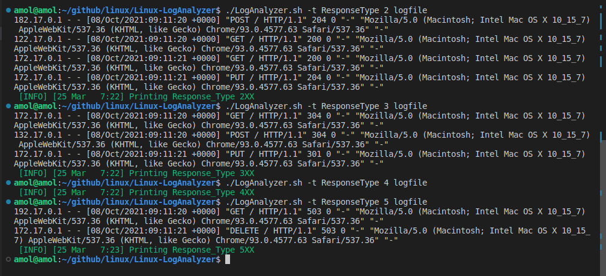

# **Linux LogAnalyzer**


## **<u>Create a utility(LogAnalyzer.sh) that will be able to</u>** :
Create a a log processing utility, to find
   - The list of all the IP's along with count
   - Request Type: GET/POST/PUT/DELETE..
   - Response Type: 200/204/301/304/503...
   - Response Type in category: 2xx,3xx,4xx,5xx

```
i.e.
./LogAnalyzer.sh IP <log_file>
./LogAnalyzer.sh -t RequestType <log_file>
./LogAnalyzer.sh -t ResponseType <log_file>
```
Sample log file
```
172.17.0.1 - - [08/Oct/2021:09:11:20 +0000] "GET / HTTP/1.1" 304 0 "-" "Mozilla/5.0 (Macintosh; Intel Mac OS X 10_15_7) AppleWebKit/537.36 (KHTML, like Gecko) Chrome/93.0.4577.63 Safari/537.36" "-"
182.17.0.1 - - [08/Oct/2021:09:11:20 +0000] "POST / HTTP/1.1" 204 0 "-" "Mozilla/5.0 (Macintosh; Intel Mac OS X 10_15_7) AppleWebKit/537.36 (KHTML, like Gecko) Chrome/93.0.4577.63 Safari/537.36" "-"
192.17.0.1 - - [08/Oct/2021:09:11:20 +0000] "GET / HTTP/1.1" 503 0 "-" "Mozilla/5.0 (Macintosh; Intel Mac OS X 10_15_7) AppleWebKit/537.36 (KHTML, like Gecko) Chrome/93.0.4577.63 Safari/537.36" "-"
132.17.0.1 - - [08/Oct/2021:09:11:20 +0000] "POST / HTTP/1.1" 304 0 "-" "Mozilla/5.0 (Macintosh; Intel Mac OS X 10_15_7) AppleWebKit/537.36 (KHTML, like Gecko) Chrome/93.0.4577.63 Safari/537.36" "-"
122.17.0.1 - - [08/Oct/2021:09:11:20 +0000] "GET / HTTP/1.1" 200 0 "-" "Mozilla/5.0 (Macintosh; Intel Mac OS X 10_15_7) AppleWebKit/537.36 (KHTML, like Gecko) Chrome/93.0.4577.63 Safari/537.36" "-"
172.17.0.1 - - [08/Oct/2021:09:11:21 +0000] "GET / HTTP/1.1" 200 0 "-" "Mozilla/5.0 (Macintosh; Intel Mac OS X 10_15_7) AppleWebKit/537.36 (KHTML, like Gecko) Chrome/93.0.4577.63 Safari/537.36" "-"
172.17.0.1 - - [08/Oct/2021:09:11:21 +0000] "PUT / HTTP/1.1" 204 0 "-" "Mozilla/5.0 (Macintosh; Intel Mac OS X 10_15_7) AppleWebKit/537.36 (KHTML, like Gecko) Chrome/93.0.4577.63 Safari/537.36" "-"
172.17.0.1 - - [08/Oct/2021:09:11:21 +0000] "PUT / HTTP/1.1" 301 0 "-" "Mozilla/5.0 (Macintosh; Intel Mac OS X 10_15_7) AppleWebKit/537.36 (KHTML, like Gecko) Chrome/93.0.4577.63 Safari/537.36" "-"
172.17.0.1 - - [08/Oct/2021:09:11:21 +0000] "DELETE / HTTP/1.1" 503 0 "-" "Mozilla/5.0 (Macintosh; Intel Mac OS X 10_15_7) AppleWebKit/537.36 (KHTML, like Gecko) Chrome/93.0.4577.63 Safari/537.36" "-"
```



